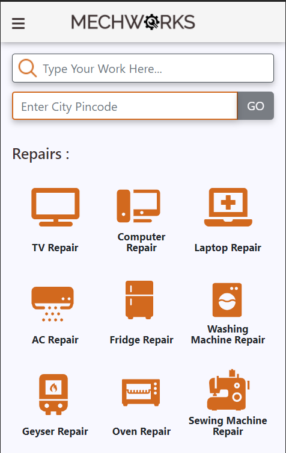
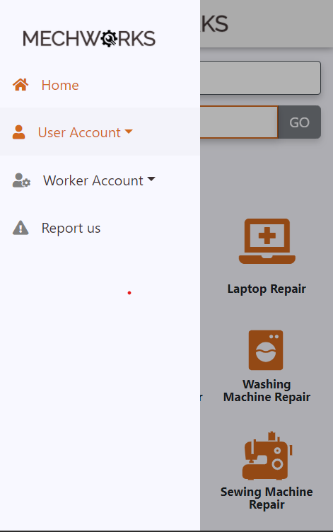
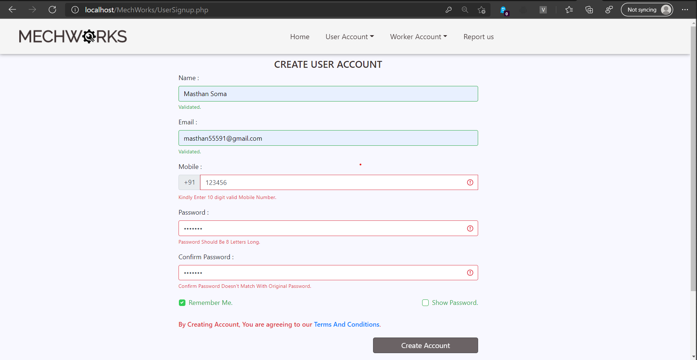
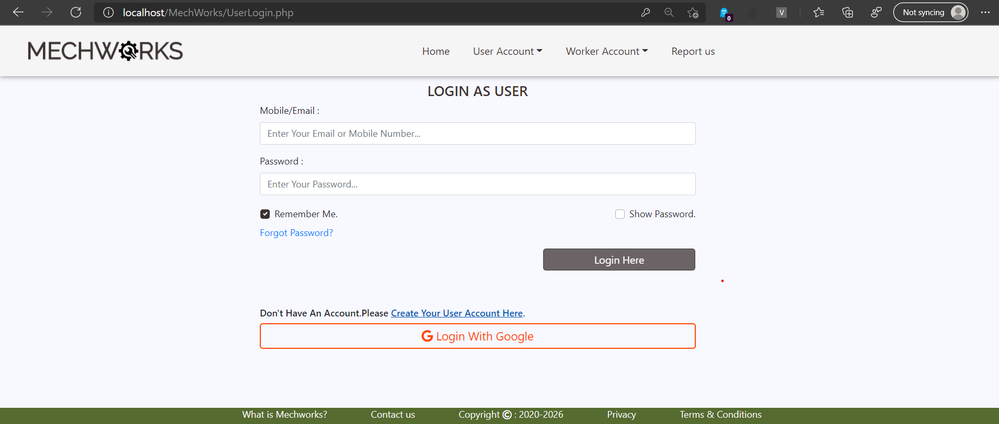
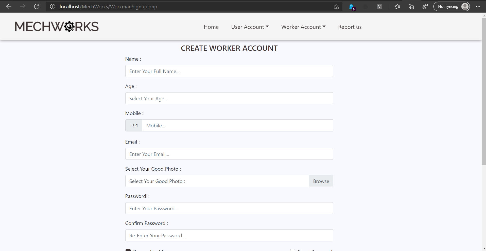
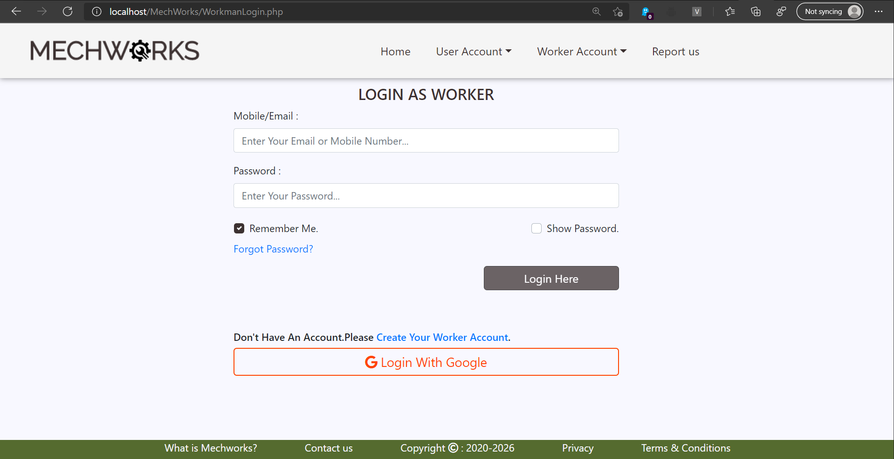
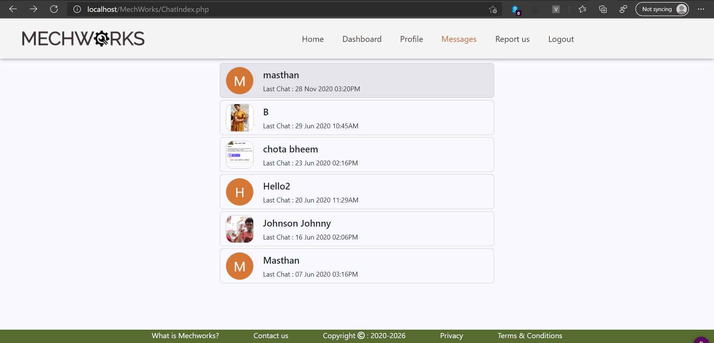
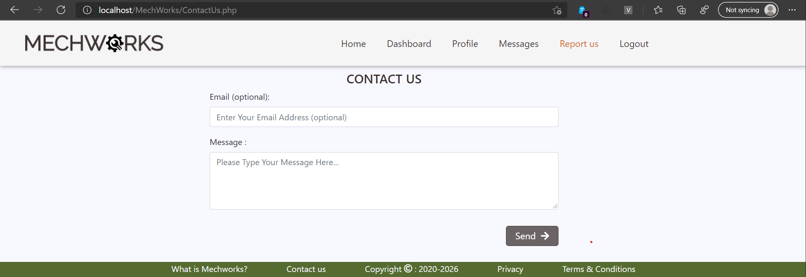

# Mechworks

### Here, Various Workers like Electrician, Plumber, Serviceman's Create a Worker Account with Their Area Pincode and work Details.The User on other side creates a User Account with pincode, so that he can find the Worker's Nearer to Him.

### Even without creating account, A User can find Workers Near to Him By Entering His/her Area Pincode in Home Page.

### Below are the Screenshots on Local Server : 

## 1.) Home Page On PC and on Mobile:

## Images On Mobile

## 2.) User Signup & Login

## 3.) Worker Signup & Login

## 4.) Messaging System

## 5.) Working Process

## 6.) Report us

