# Mechworks

### Various Workers like Electrician, Plumber, Serviceman's Create a Worker Account with Their Pincode and work Details.The User on other side creates a User Account with pincode and he can find the Worker's Near to Him.

### Even without creating account a User can find Workers Near to Him By Entering His/her in Home Page.

### Below are the Screenshots From Local Server : 

### 1.) Home Page On PC and on Mobile:
image: 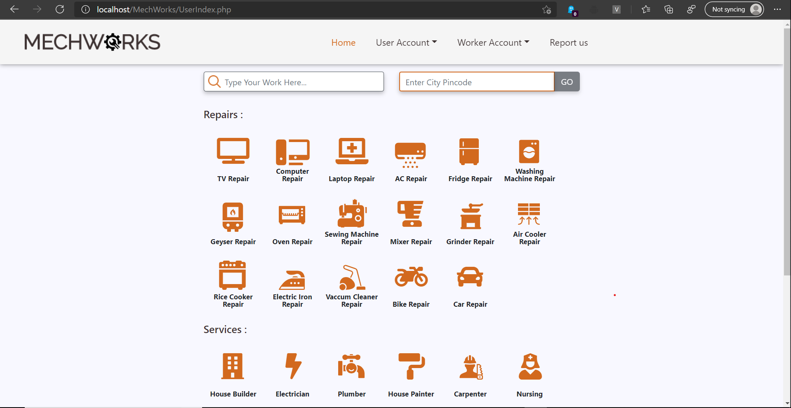
image: 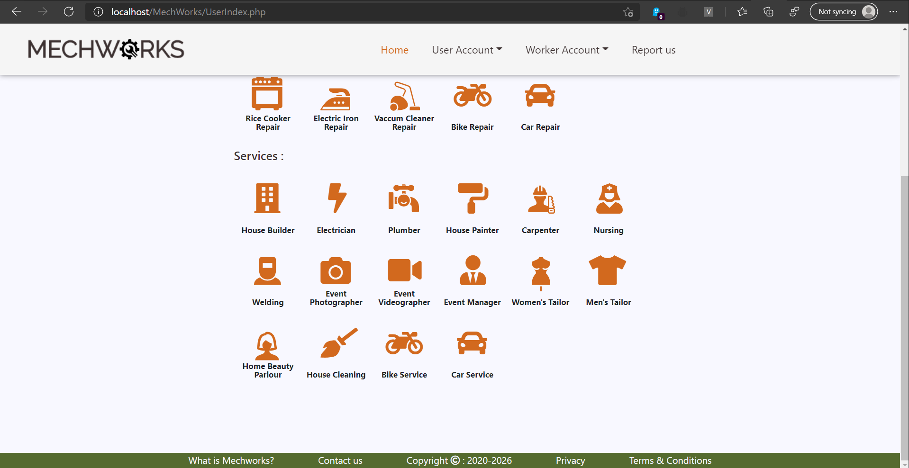
image: 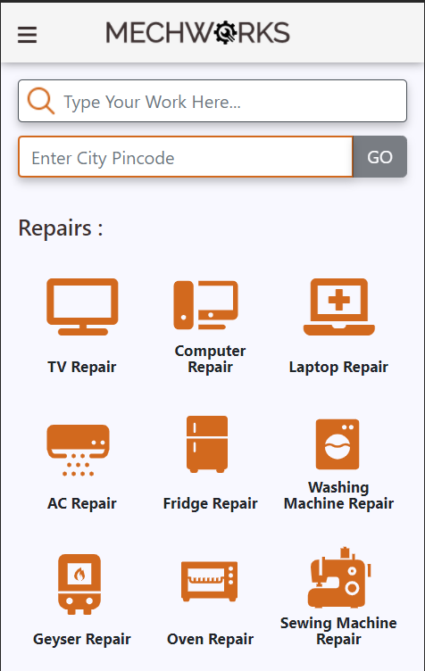
image: 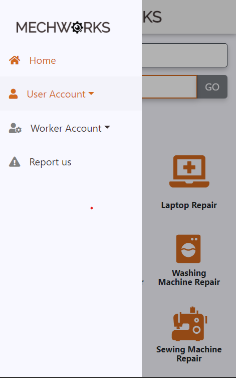

### 2.) User Signup & Login
image: 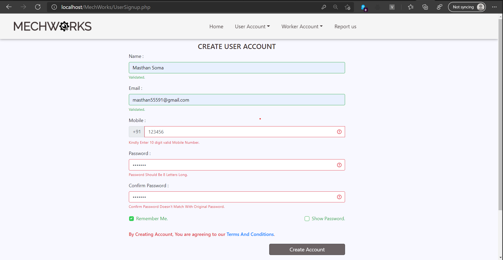
image: 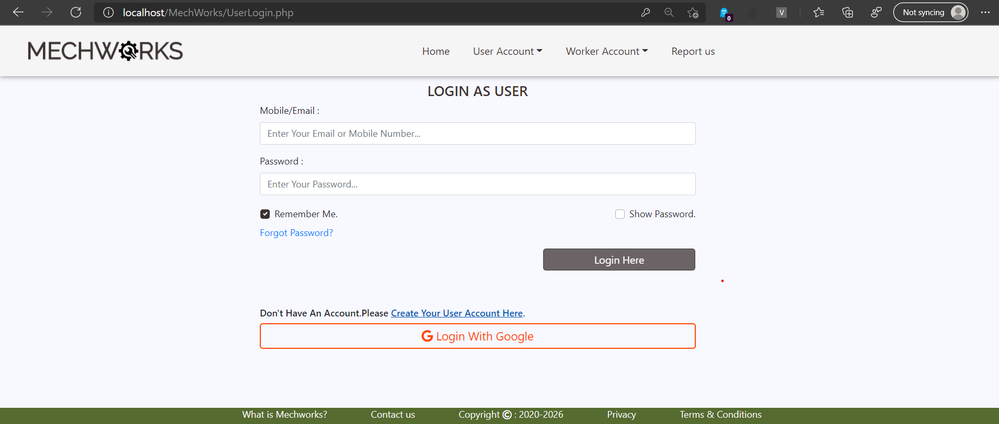

### 3.) Worker Signup & Login
image: 
image: 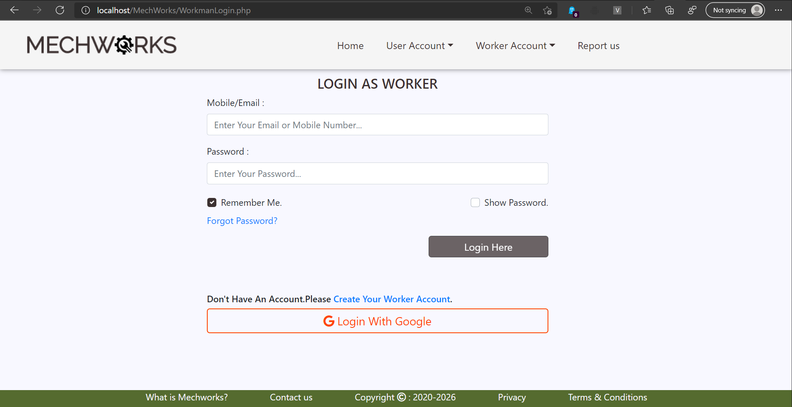

### 4.) Messaging System
image: 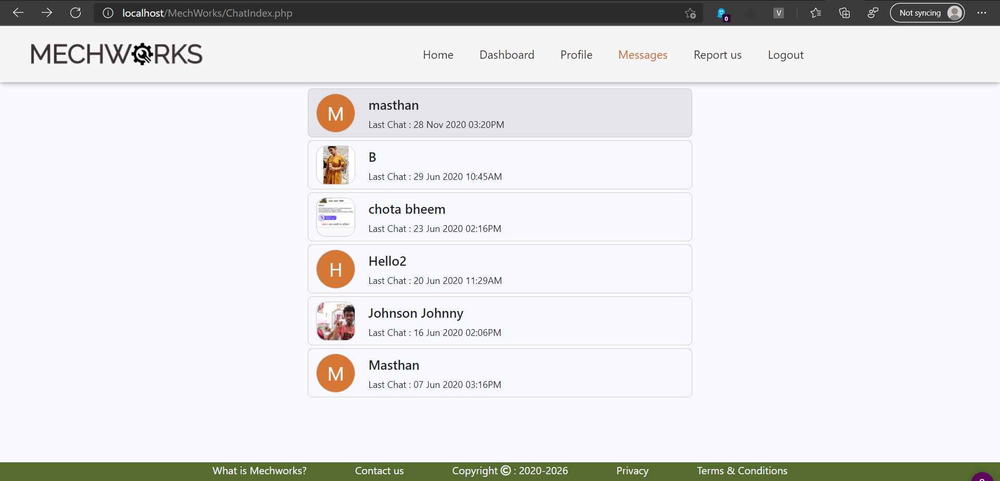
image: 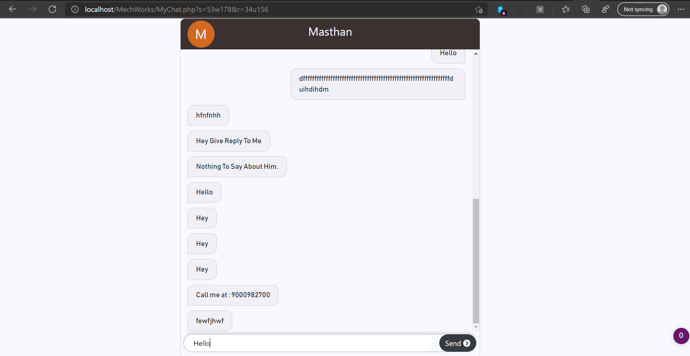

### 5.) Working Process
image: 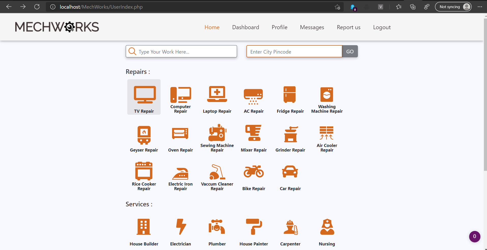
image: 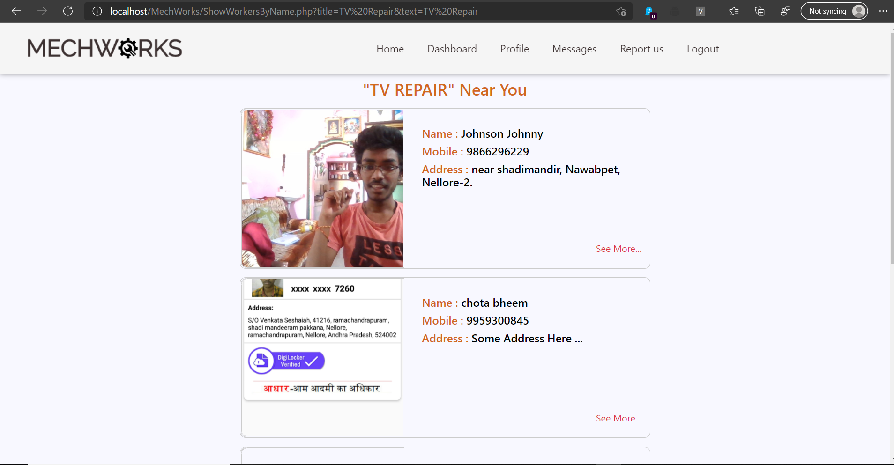
image: 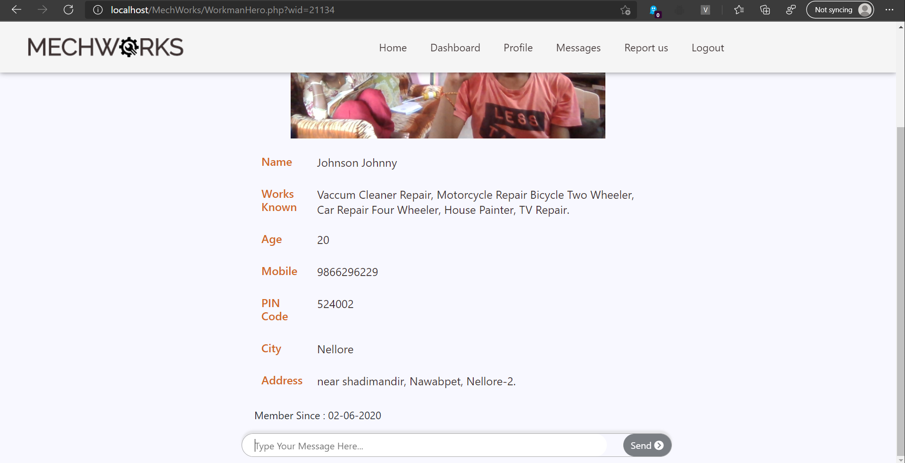

### 6.) Report us
image: 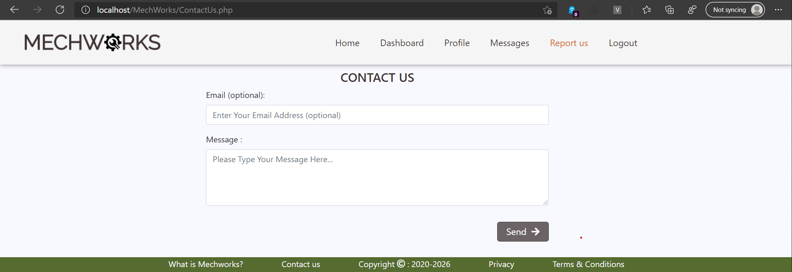
